# Fabric Unified Admin Monitoring (FUAM)

```diff
- FUAM is now part of the Fabric Toolbox and will be actively developed there.
- As part of this step we also merged both version.
- The complete FUAM solution available as an open-source solution. 
```
**If you want to get more information or deploy the latest version, head over to Fabric toolbox:**

### [Explore FUAM in fabric-toolbox](https://github.com/microsoft/fabric-toolbox/tree/main/monitoring/fabric-unified-admin-monitoring)


-----------------------
-----------------------
-----------------------


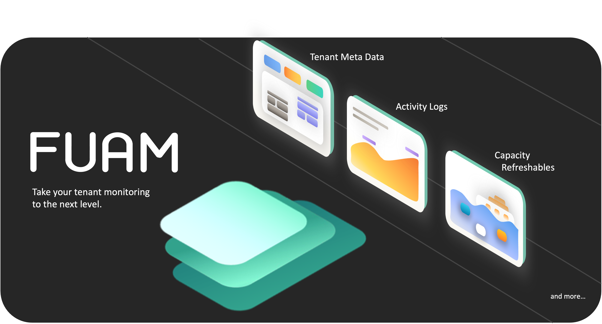

## Introduction

Fabric Unfied Admin Monitoring (short: FUAM) is a solution to enable a holistic monitoring on top of Power BI and Fabric. 
Today monitoring for Fabric can be done through different reports, apps and tools. Here is a short overview about the available monitoring solutions which are shipped with Fabric:
- Feature Usage & Adoption
- Purview Hub
- Capacity Metrics App
- Workspace Monitoring
- Usage Metrics Report


FUAM has the goal to provide a more holistic view on top of the various information, which can be extracted from Fabric, allowing it's users to analyze at a very high level, but also to deep dive into specific artifacts for a more fine granular data analysis.

[Watch FUAM Introduction video on Youtube](https://www.youtube.com/watch?v=Ai71Xzr_2Ds)

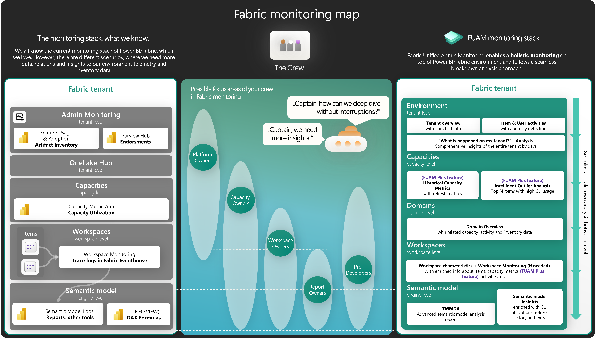

FUAM is completely build with Fabric capabilities with Pipelines and Notebooks as the main tool to extract and transform data. All of the data is stored in it's raw format, but also in Delta Parquet, enabling the user to directly use it through Power BI Direct Lake or the Lakehouse SQL Endpoint via SQL.
FUAM comes with a set of standard report enabling a quick overview on the data, but it's intended to give the users all tool to customize or build the own reports on top of the data model. Through the openness of Fabric it's of course also possible to combine it with your own data enabling you to do the analysis you wish.


## Versions

There are two different versions of FUAM available:
- **FUAM Basic:** Provides all the information, which can be extracted through official APIs, to make most of your tenants data available. This is the version available through this github
- **FUAM Plus:** Provides additional information, like long-term Capacity Metrics data, which needs to be extracted through other means. Therefore FUAM Plus needs a certain amount of support for deploying and maintaining the solution. If you are interessted in a more deep dive on FUAM Plus, please contact us directly.


## FUAM Basic Content
FUAM Basic extracts the following data from the tenant:
- Tenant Settings
- Delegated Tenant Settings
- Activities
- Workspaces
- Capacities
- Tenant meta data (Scanner API)
- Capacity Refreshables
- Git Connections


### Architecture

The architecture of FUAM is built on **Fabric items** like Pipelines, Notebooks, Lakehouses, Semantic models and Power BI reports.
We have built the component in a **modular structure**, which helps you to extend FUAM with your own modules. This architecture design helps to maintain the solution also with ease.

The **data ingestion** logic is orchastrated and parametizable, which allows to use the main orchestration pipeline for initial and incremental data loads.
**FUAM Lakehouse** is one of the core component in the architecture. All the data is transformed and persisted in a way, which open amazing capabilities analyzing the collected data in a semantic model with DirectLake mode.
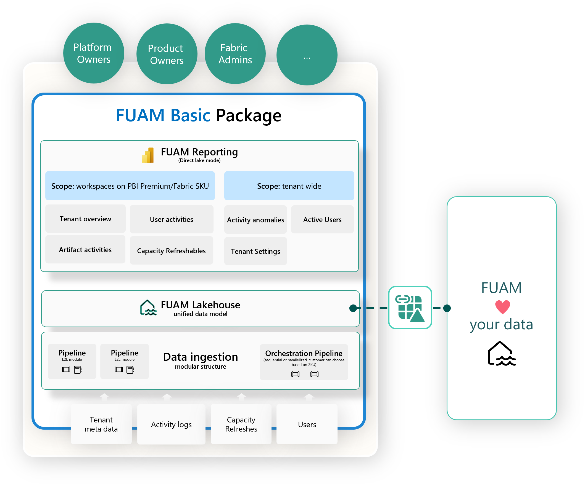

Architectural documentation can be found on our Wiki page: [FUAM Architecture](https://github.com/GT-Analytics/fuam-basic/wiki/Architecture)

------------------------------------

# FUAM Basic Deployment

Are you ready to try FUAM out? We have prepared two step-by-step documentations, which support you to deploy FUAM in your workspace on your tenant.

[Click here to **deploy** FUAM Basic](https://github.com/GT-Analytics/fuam-basic/wiki/Lifecycle:-Initial-Deployment-via-Notebook)

[Click here to **upgrade** FUAM Basic](https://github.com/GT-Analytics/fuam-basic/wiki/Lifecycle:-Upgrading-via-Notebook)

------------------------------------

# Other Documentation

We have collected all insights, documentation and helpful links in our wiki.

[Go to FUAM wiki](https://github.com/GT-Analytics/fuam-basic/wiki)

## Remarks & Limitations

There are couple of important information, which you should know.
Please visit for more details the
[Read Remarks on wiki](https://github.com/GT-Analytics/fuam-basic/wiki/Remarks-to-FUAM)


## Important

- This is a community project that is **not** supported by Microsoft.
- **The code in this repository and any related information are without warranty of any kind.**
- The deployed solution will utilize CUs (Compute Units) on your Microsoft Fabric SKU on your PBI/Fabric tenant.
- FUAM Basic has been tested on some large tenants, however the CU utilization depends on multiple factors like: count of Fabric SKUs, count of workspaces, count of users, count of changes within the tenant, etc.
- Please test the solution on a non-production Fabric SKU first without impacting other workloads on your tenant.


------------------------------------

# FUAM Reporting | Screenshots

FUAM comes with a set of standard report enabling a quick overview on the data, but it's intended to give the users all tool to customize or build the own reports on top of the data model.

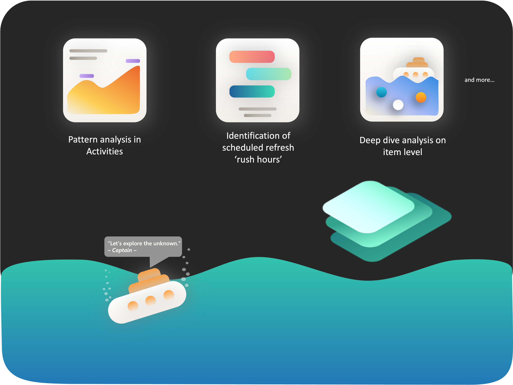

#### FUAM Reporting | Tenant Overview | Screenshots
Report name in Workspace: **FUAM_Basic_Overview_Report** 

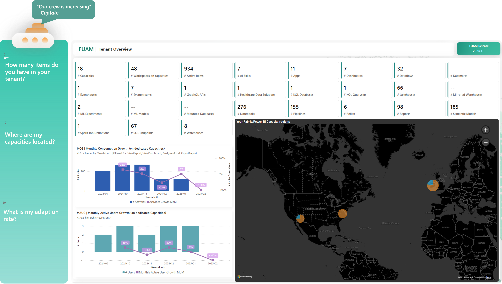

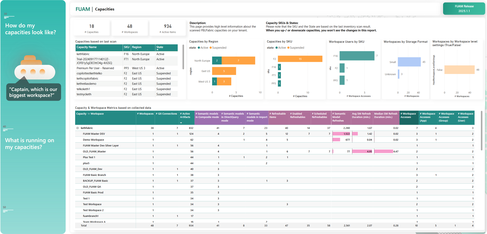

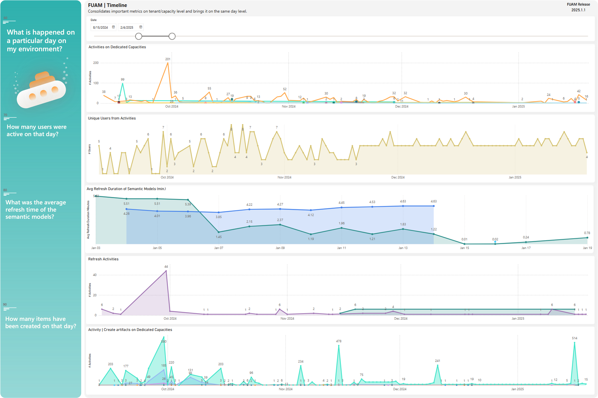

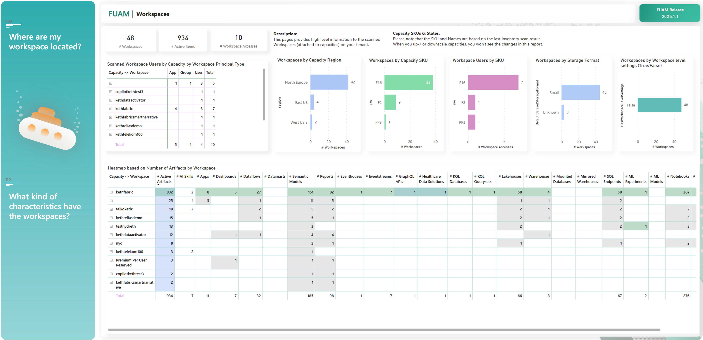

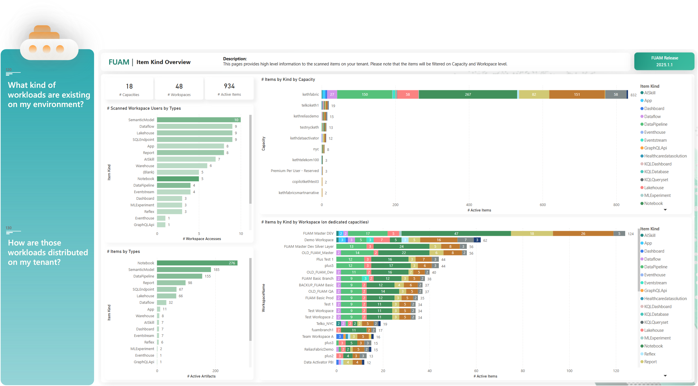

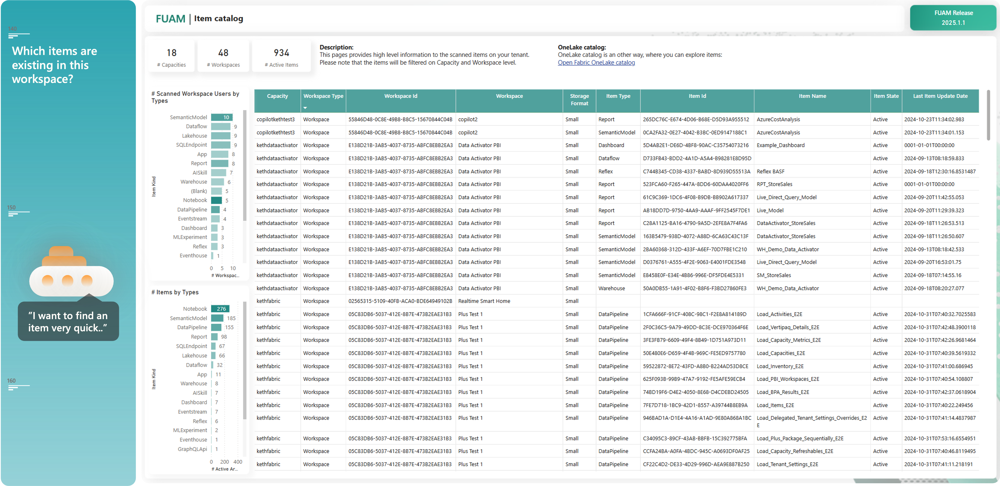

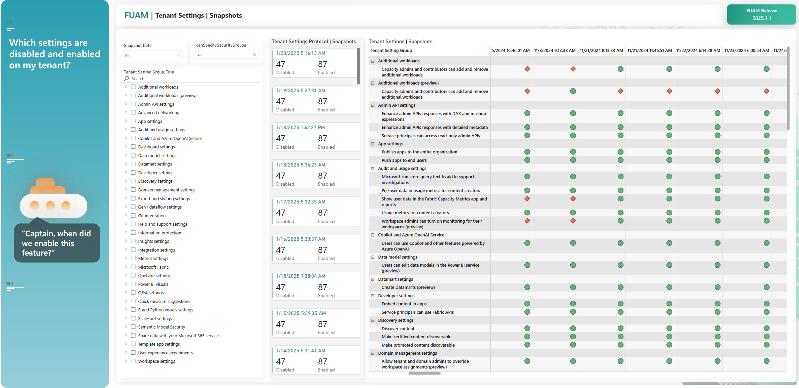

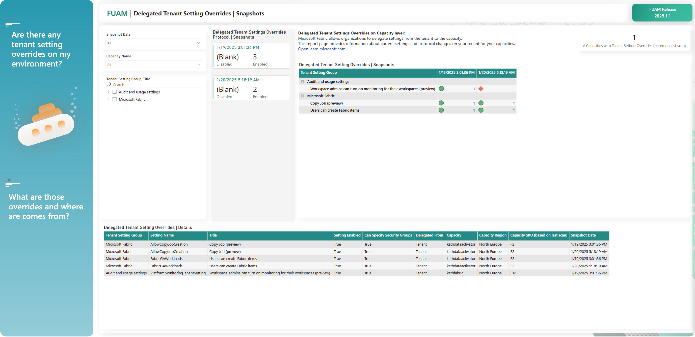

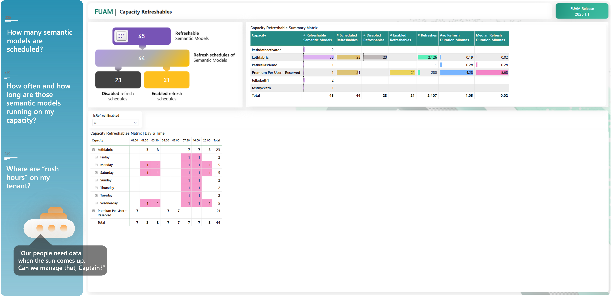

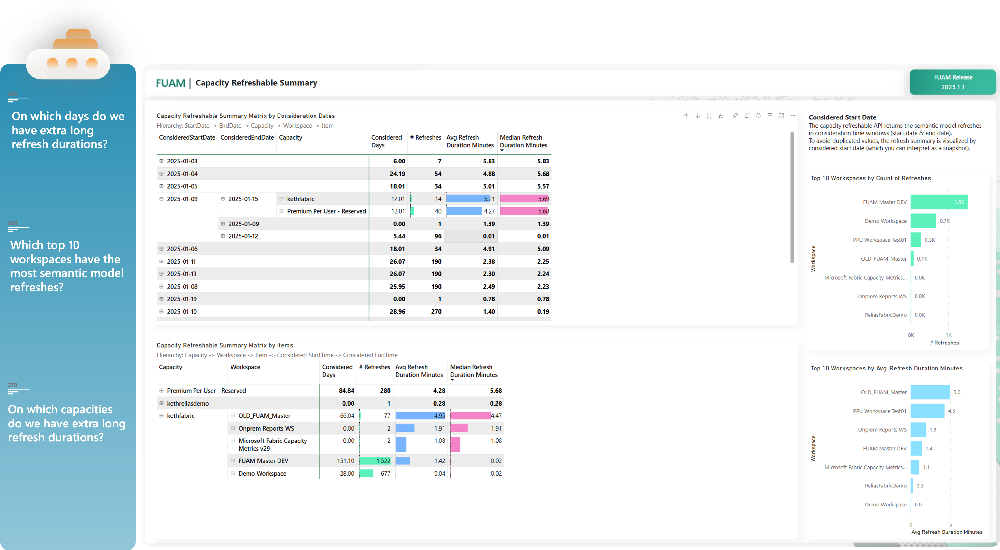

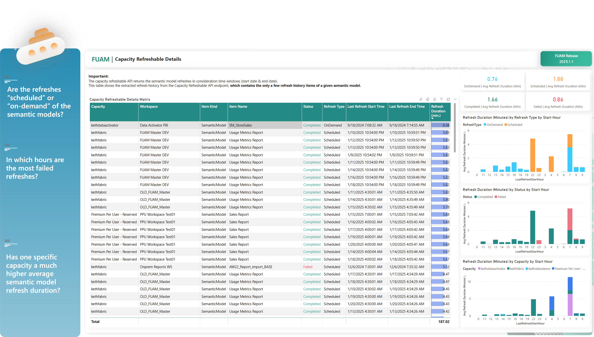

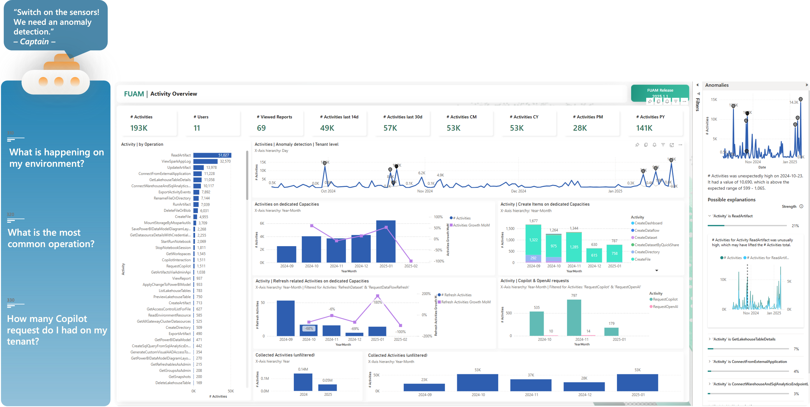

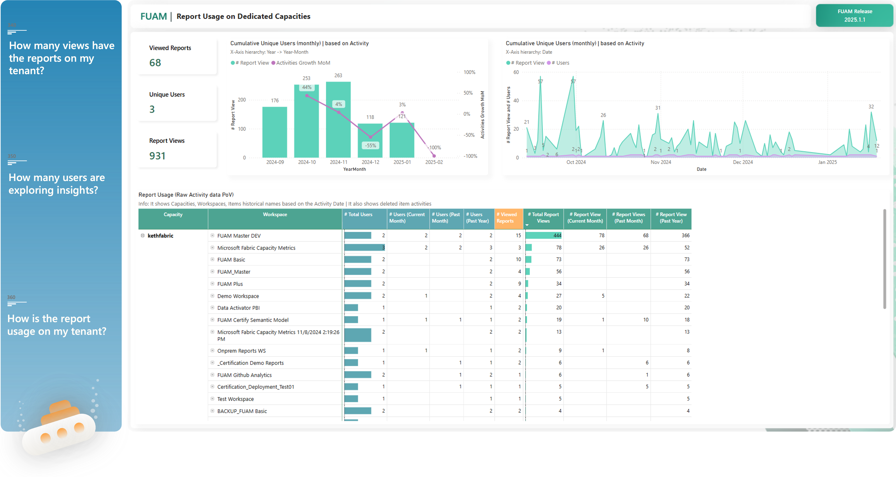

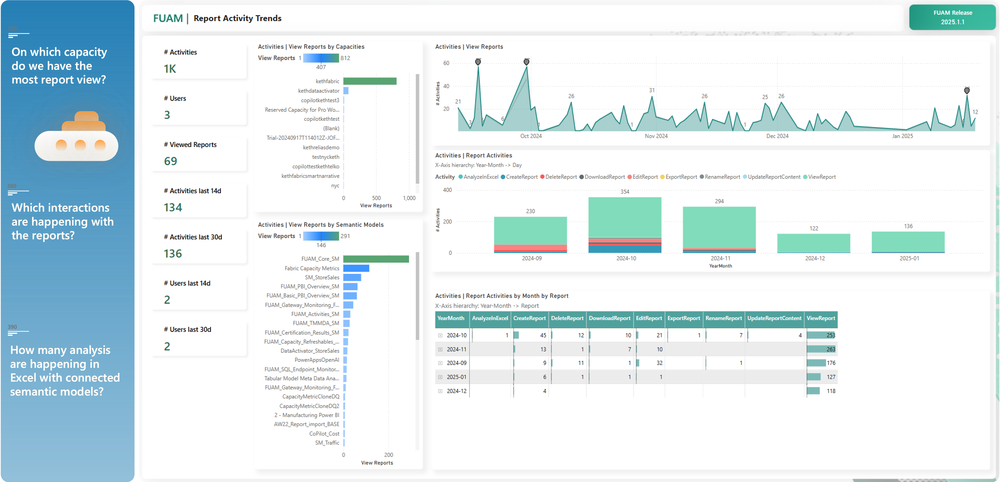

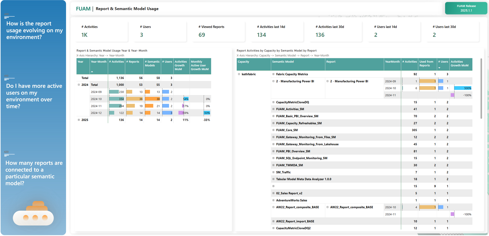

--------------------------


### Logo
<p align="center">
  
</p>
